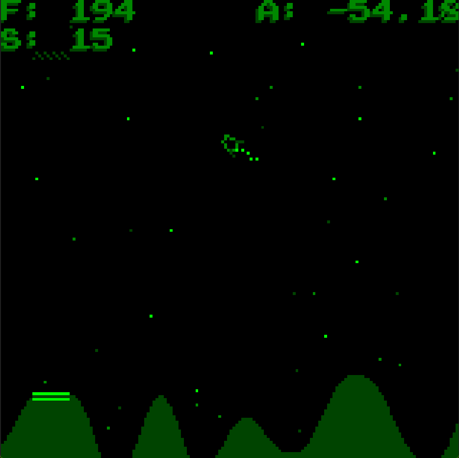
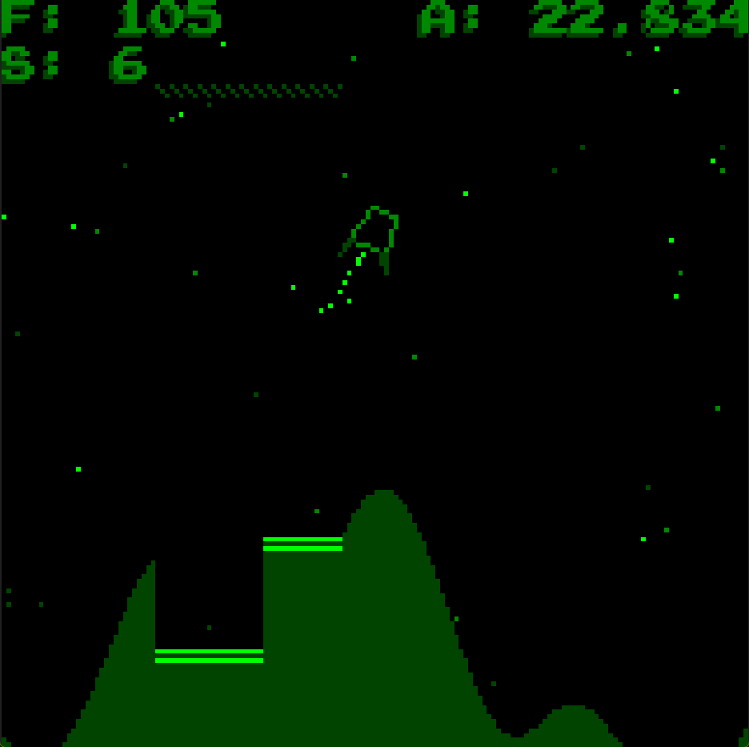

# Rust WASM Lander

A game written in Rust for the [WASM-4](https://wasm4.org) fantasy console.




Objective:

Land on one of the several landing pads on the lunar surface. However you must land safely, ensure your speed is low (10 or less) and you are landing straight as possible! But be careful, your fuel is limited!

Controls:

- Rotate ship: Left & right arrows
- Fire thrusters: X 

## Play!

The game is published as a WASM bundle with static HTML& JS and hosted on GitHub Pages, and is playable on mobile and standard browsers

[![Button]][Link]

[Link]: https://code.benco.io/wasm-lander/
[Button]: https://img.shields.io/badge/Play%20The%20GAME!-37ff79?style=for-the-badge&logo=airplayvideo&logoColor=black

## Getting Started

- Install [Rust & Cargo](https://www.rust-lang.org/tools/install)
- run `make install-tools` to install **w4** and **wasm-opt** locally

## Building

Build the cart by running:

```shell
make build
```

Then run the browser HTML version with:

```shell
make run
```

This will auto start a web server and open the game in your browser

## Bundling

To output binaries for Linux, Windows and an standalone HTML page, run:

```shell
make publish
```

## Make

```text
❯ make help
 _          _       
| |__   ___| |_ __  
| '_ \ / _ \ | '_ \ 
| | | |  __/ | |_) |
|_| |_|\___|_| .__/ 
             |_|    
help                 💬 This help message :)
lint                 🔎 Check for linting and formatting errors
lint-fix             🧙 Fix linting and formatting errors
install-tools        🔮 Install dev tools and pre-reqs
build                🔨 Build the game cart WASM
clean                🧹 Clean up build artifacts
run                  🚀 Run the game and start the web server
watch                👀 Run the game with reload on file change
publish              🎁 Bundle for distribution (exe and HTML)
```

For more info about setting up WASM-4, see the [quickstart guide](https://wasm4.org/docs/getting-started/setup?code-lang=rust#quickstart).

## Links

- [Documentation](https://wasm4.org/docs): Learn more about WASM-4.
- [Snake Tutorial](https://wasm4.org/docs/tutorials/snake/goal): Learn how to build a complete game
  with a step-by-step tutorial.
- [GitHub](https://github.com/aduros/wasm4): Submit an issue or PR. Contributions are welcome!
